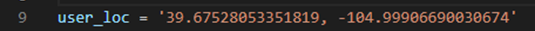
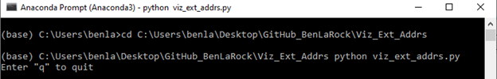

**Getting Started**

Everything here is written from the perspective of a Windows user. Steps
and commands will be slightly different for other environments.

**Project Dependencies**

<u>Install Anaconda and Project’s Dependencies</u>

Download and install the Anaconda Python distribution.

<https://www.anaconda.com/products/individual>

(Recommended) Create a virtual environment for the project’s
dependencies.

<https://boscacci.medium.com/why-and-how-to-make-a-requirements-txt-f329c685181e>

<u>Clone / Fork the GitHub Repo</u>

Git Bash option with HTTPS:

<https://github.com/BenLaRock/visualize-external-addresses.git>

In Anaconda Prompt:

(Recommended) activate virtual environment from above: ‘**conda activate <venv_name>**’

Change directory to where you cloned the repo: ‘**cd <cloned_directory_name>**’

Install dependencies from requirements.txt: ‘**pip install -r requirements.txt**’

*If you get a permissions error, try using the --user flag: **pip install -r requirements.txt --user**’*

<u>Install Google Earth Pro</u>

It’s free!

<https://www.google.com/earth/download/gep/agree.html?hl=en-GB>

**Prepare the Script**

<u>Add User Location Coordinates</u>

If you don’t know your current location’s coordinates (decimal degrees)
– and why would you? – the easiest way to do this is to go to Google
Maps… <https://www.google.com/maps/place/Denver,+CO/>

And right click anywhere, then click on the first row of the pop up.
This will be a latitude-longitude coordinate in decimal degrees. (The
script currently only accepts decimal degrees).

Then update the ‘user_loc’ variable in the script:

<u>Run the Script via Command Line</u>

*Do this before you connect Google Earth to the KML for the first time
as there won’t be a KML file for you to link to. Once you’ve run the
script at least once, there will be a KML for you to go back and re-link
to if necessary.*

Use the Anaconda prompt and change directory to the local folder where
you cloned the repo. Then type ‘**python viz_ext_addrs.py**’ (for
Windows) to run the script:

You can stop the script after that with ‘**q**’.

<u>Link Google Earth to the KML</u>

Open Google Earth and go to ‘Add’, then click ‘Network Link’:

Enter a name for the KML and browse to the directory where the KML you
created above is stored (make sure to click the actual KML file). Then
set ‘Time-Based Refresh’ to ‘Periodically’ for every ‘1 secs’ (the
script iterates every 5 seconds, so this is a good default to use). Then
click ‘OK’:

*Personally, I would not check the ‘Fly to View on Refresh’ box or else
Google Earth will jump around on every refresh - unless you want that.*

After that, you should see the simple KML we created above with just one
point which is the user location you provided:

Now you’re ready to use the script!

**Fire It Up**

Go back to the Anaconda prompt – and change directory back to where the
cloned repo is if needed – and run the script again with ‘**python
viz_ext_addrs.py**’.

You should now see Google Earth start to refresh with new network
connections:

**Closing Thoughts**

Stay tuned as I develop this into a more robust capability.
