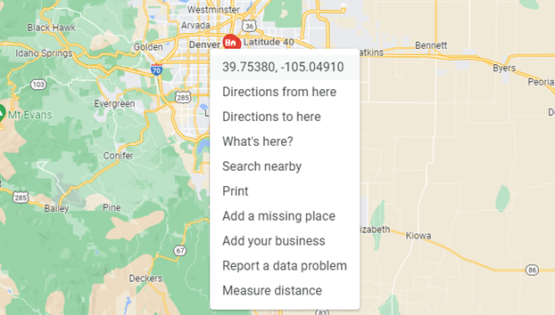
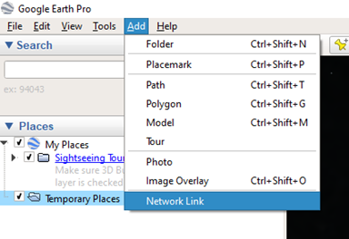
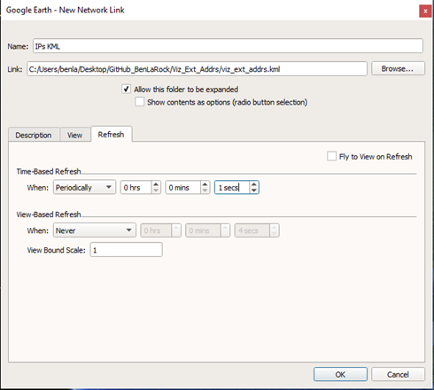
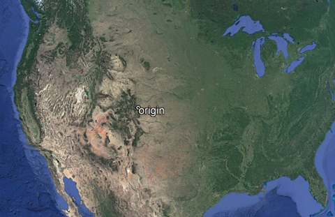
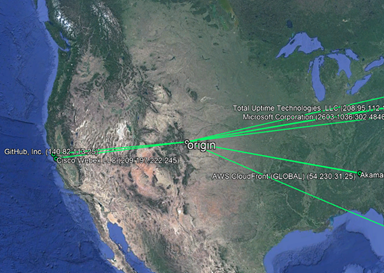
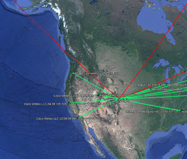

## Getting Started

- Everything here is written from the perspective of a Windows user. Steps and commands will be slightly different for other environments.


- Find your location:

  - If you don’t know your current location’s coordinates (decimal degrees) – and why would you? – the easiest way to do this is to go to Google Maps… (<https://www.google.com/maps/place/Denver,+CO/>)

  - And right click anywhere, then click on the first row of the pop up. This will be a latitude-longitude coordinate in decimal degrees. (The script currently only accepts decimal degrees).

    

- Get information about the tool:
  ```bash
  python viz_ext_addrs.py --help
  ```

## Install Anaconda and Dependencies

- Download and install the Anaconda Python distribution:

  <https://www.anaconda.com/products/individual> 


- Create a virtual environment for the project’s dependencies:

  <https://boscacci.medium.com/why-and-how-to-make-a-requirements-txt-f329c685181e>


- Clone / Fork the GitHub Repo:
  ```bash
  git clone https://github.com/BenLaRock/visualize-external-addresses.git
  ```

- Activate the virtual environment with Anaconda prompt:
  ```bash
   conda activate <venv_name>
   ```

- Change directory into the cloned repo:
  ```bash
  cd <cloned_directory_name>
  ```

- Install dependencies from requirements.txt:
  ```bash
  pip install -r requirements.txt
  ```

- *If you get a permissions error, try adding the --user flag:*
  ```bash
  pip install -r requirements.txt --user
  ```

- Install Google Earth Pro (it's free for individuals):

  <https://www.google.com/earth/download/gep/agree.html?hl=en-GB>

## Prepare the Script via Command Line

*Do this before you connect Google Earth to the KML for the first time as there won’t be a KML file for you to link to. Once you’ve run the script at least once, there will be a KML for you to go back and link / re-link to.*

- Change directory to the local folder where you cloned the repo, then run the script:
  ```bash
  python viz_ext_addrs.py
  ```

- Start the script and then stop it with ‘q’.

## Link Google Earth to the KML:

- Open Google Earth and go to ‘Add’, then click ‘Network Link’:

  

- Enter a name and browse to the directory where the KML you created above is stored (make sure to click the actual KML file). Then set ‘Time-Based Refresh’ to ‘Periodically’ for every ‘1 secs’ (the script iterates every 5 seconds, so this is a good default to use). Then click ‘OK’:

  

  *Personally, I would not check the ‘Fly to View on Refresh’ box or else Google Earth will jump around on every refresh - unless you want that.*

- After that, you should see the simple KML we created above with the default user location:

  

- Now you’re ready to use the script!

## Fire It Up!
- Change directory to where the cloned repo is again if needed. And run the script with the default location (Bloomfield, CO, USA):
  ```bash
  python viz_ext_addrs.py
  ```

- Or specify your location:
  ```bash
  python viz_ext_addrs.py --loc 47.617, -122.32
  ```

- You should now see Google Earth start to refresh with new network connections:

  

  </br>
  
  

## Closing Thoughts

I will be contributing updates to this for the foreseeable future so stay tuned as I develop this into a more robust capability.
